# Architecture Documentation

## E2E SDLC Platform Engineering Demonstration

This document provides detailed architectural diagrams and explanations for the end-to-end SDLC demonstration platform.

---

## Table of Contents

1. [System Overview](#system-overview)
2. [Component Architecture](#component-architecture)
3. [Workflow Diagrams](#workflow-diagrams)
4. [Deployment Strategy](#deployment-strategy)
5. [Network Architecture](#network-architecture)
6. [Component Interactions](#component-interactions)

---

## System Overview

### High-Level Architecture

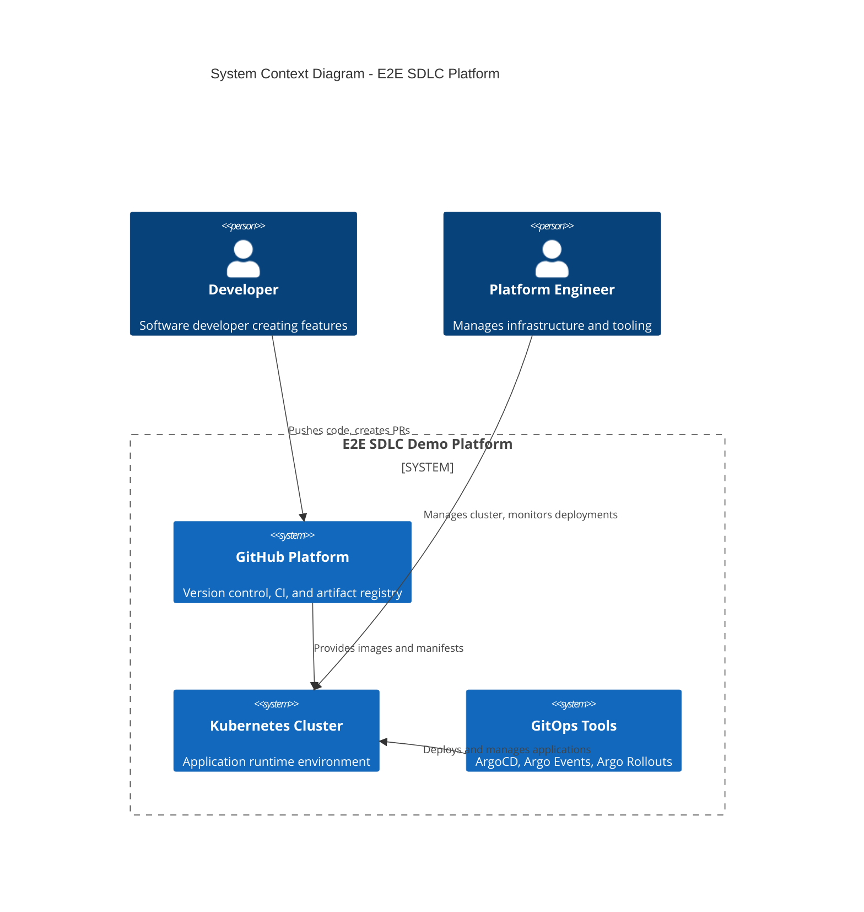

### End-to-End Data Flow

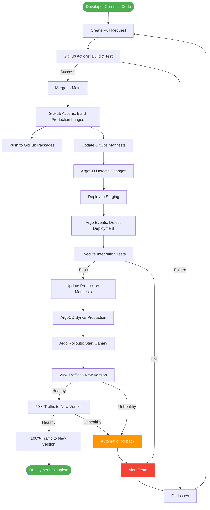

---

## Component Architecture

### Kubernetes Cluster Components

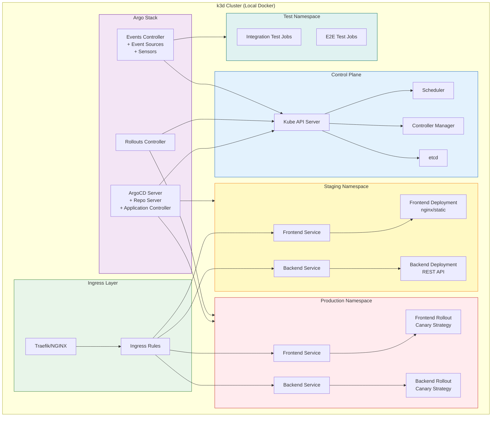

### Application Architecture

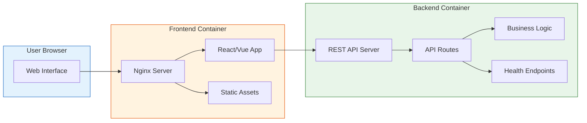

---

## Workflow Diagrams

### Complete CI/CD Pipeline

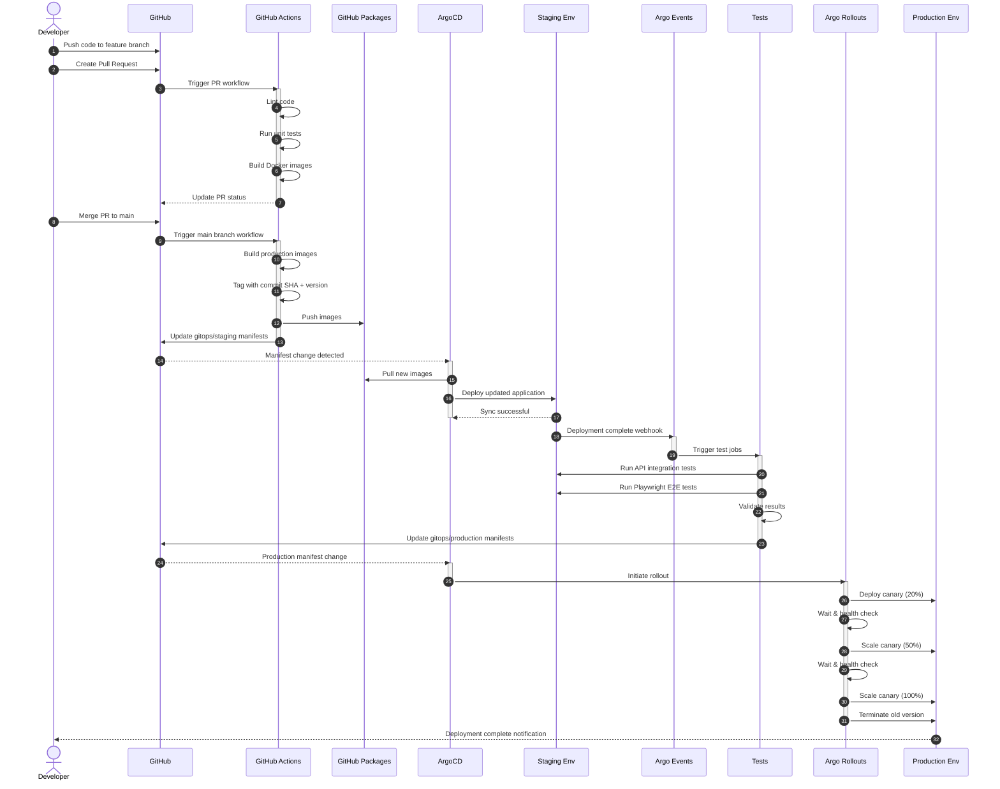

### GitOps Sync Process

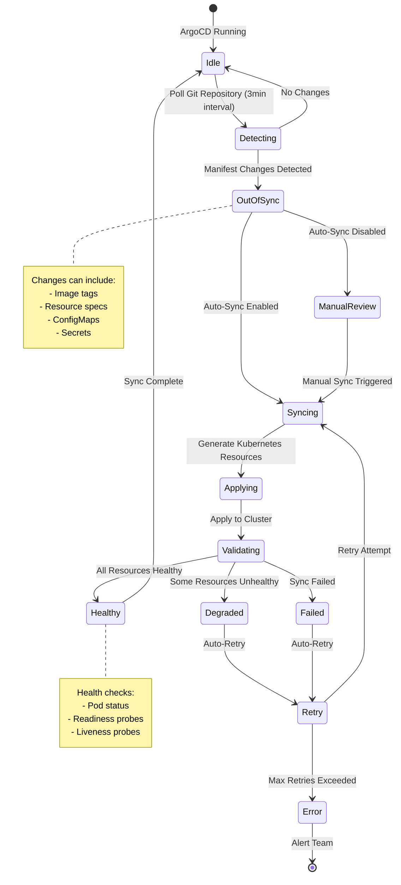

### Argo Events Trigger Flow

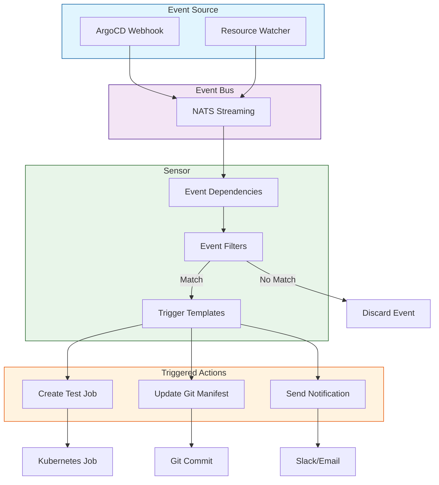

---

## Deployment Strategy

### Canary Deployment Progression

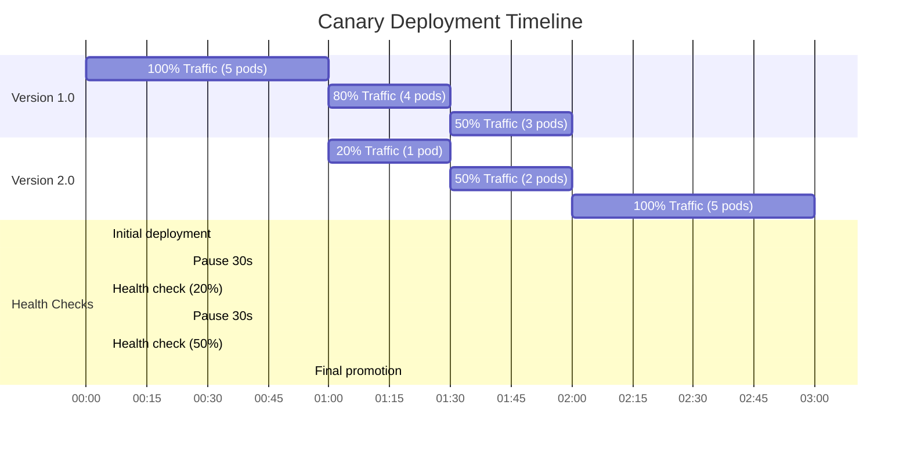

### Progressive Traffic Shift

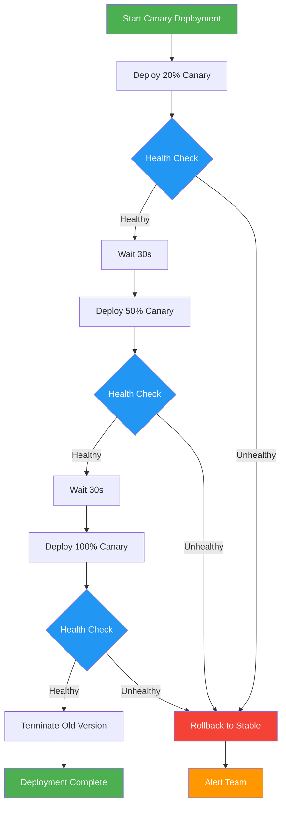

### Rollback Strategy

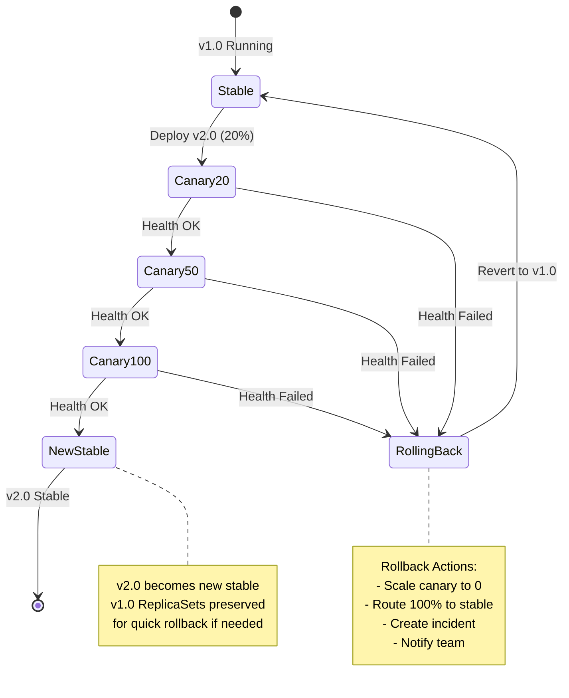

---

## Network Architecture

### Ingress and Service Mesh

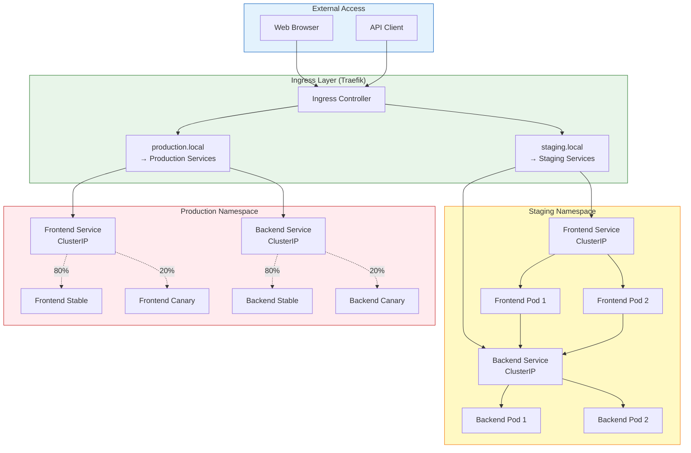

### Service Communication

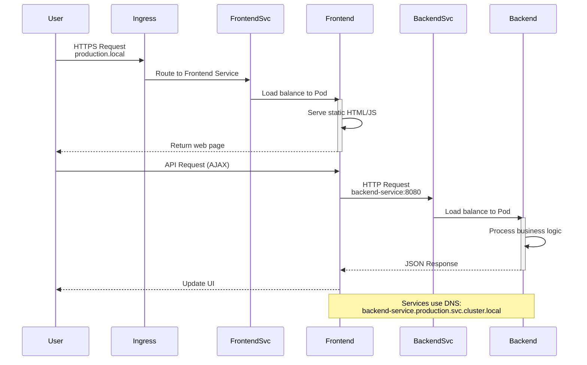

---

## Component Interactions

### ArgoCD Application Sync

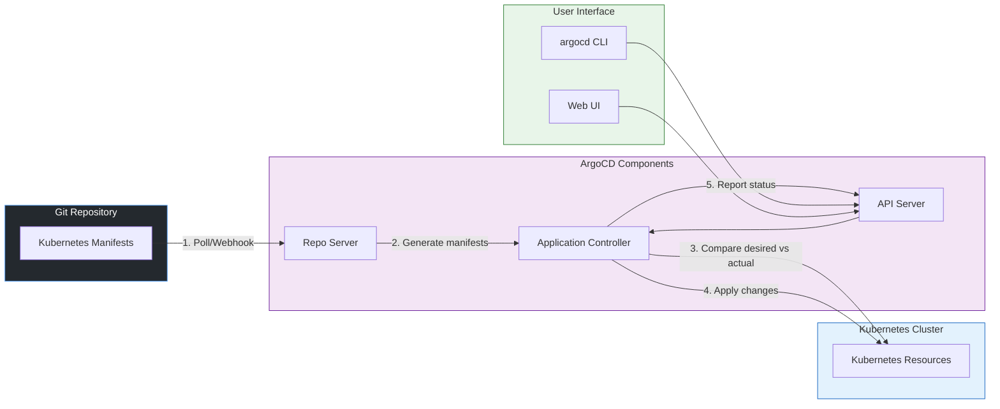

### Argo Rollouts Analysis Loop

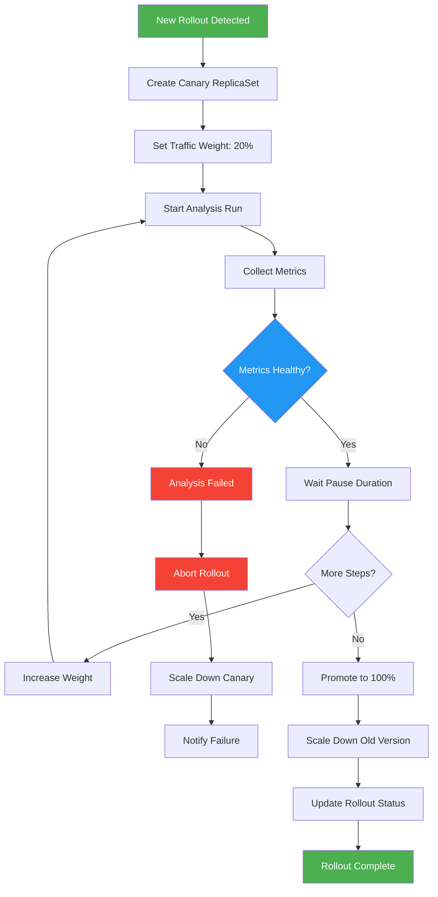

---

## Repository Structure Visualization

```mermaid
graph TD
    Root[e2e-platform-engineering/]
    
    Root --> Docs[docs/]
    Root --> Scripts[scripts/]
    Root --> App[app/]
    Root --> GitOps[gitops/]
    Root --> Tests[tests/]
    Root --> GHA[.github/]
    
    Docs --> DocArch[architecture.md]
    Docs --> DocSetup[setup-guide.md]
    Docs --> DocWalk[walkthrough.md]
    
    Scripts --> Setup[setup-cluster.sh]
    Scripts --> InstallArgoCD[install-argocd.sh]
    Scripts --> InstallRollouts[install-argo-rollouts.sh]
    Scripts --> Cleanup[cleanup.sh]
    
    App --> Frontend[frontend/]
    App --> Backend[backend/]
    
    Frontend --> FESrc[src/]
    Frontend --> FEDocker[Dockerfile]
    Backend --> BESrc[src/]
    Backend --> BEDocker[Dockerfile]
    
    GitOps --> ArgoApps[argocd/]
    GitOps --> Staging[staging/]
    GitOps --> Production[production/]
    GitOps --> Events[argo-events/]
    
    Staging --> SKust[kustomization.yaml]
    Staging --> SFE[frontend-deployment.yaml]
    Staging --> SBE[backend-deployment.yaml]
    
    Production --> PKust[kustomization.yaml]
    Production --> PFE[frontend-rollout.yaml]
    Production --> PBE[backend-rollout.yaml]
    
    Tests --> Integration[integration/]
    Tests --> E2E[e2e/]
    
    GHA --> Workflows[workflows/]
    Workflows --> CIFE[ci-frontend.yaml]
    Workflows --> CIBE[ci-backend.yaml]
    
    style Root fill:#24292e,stroke:#58a6ff,color:#fff
    style App fill:#0969da,stroke:#54aeff,color:#fff
    style GitOps fill:#8250df,stroke:#a371f7,color:#fff
    style Tests fill:#bf3989,stroke:#d2a8ff,color:#fff
    style Scripts fill:#1f6feb,stroke:#58a6ff,color:#fff
```

---

## Technology Integration Map

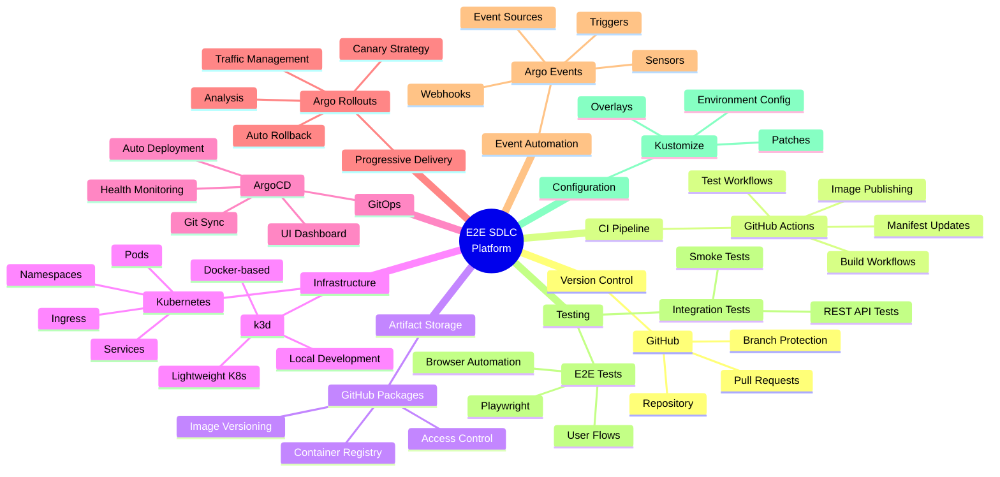

---

## Summary

This architecture demonstrates a modern, cloud-native approach to software delivery with:

- **Full Automation**: From commit to production deployment
- **GitOps Principles**: Git as single source of truth
- **Progressive Delivery**: Risk-mitigated releases via canary deployments
- **Event-Driven Testing**: Automated quality gates
- **Local Development**: No cloud costs, fast iteration
- **Production Practices**: Real-world patterns and tools

The architecture is designed to be:
- **Educational**: Clear separation of concerns
- **Extensible**: Easy to add monitoring, security scanning, etc.
- **Reproducible**: Fully scripted setup
- **Representative**: Uses industry-standard tools and patterns
