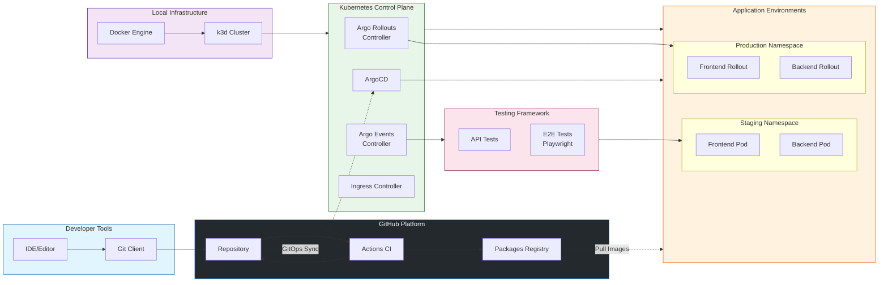
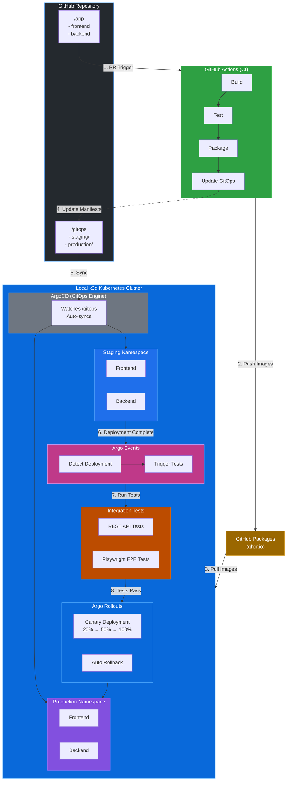
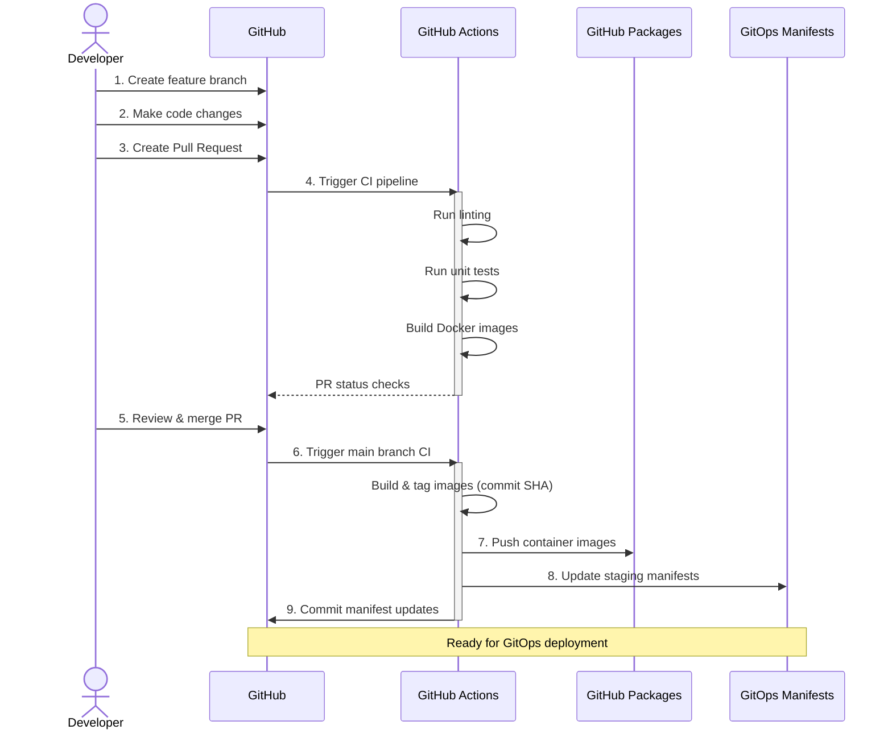
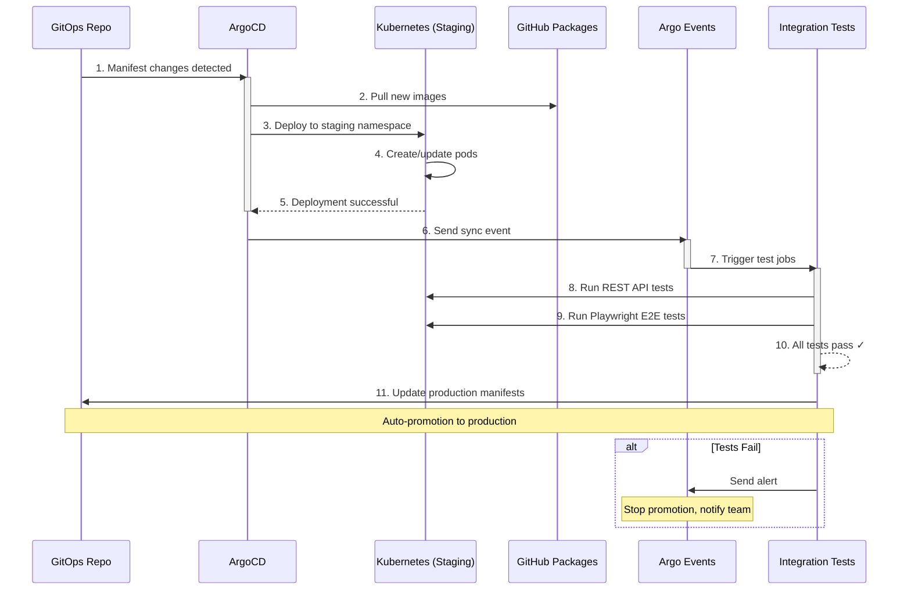
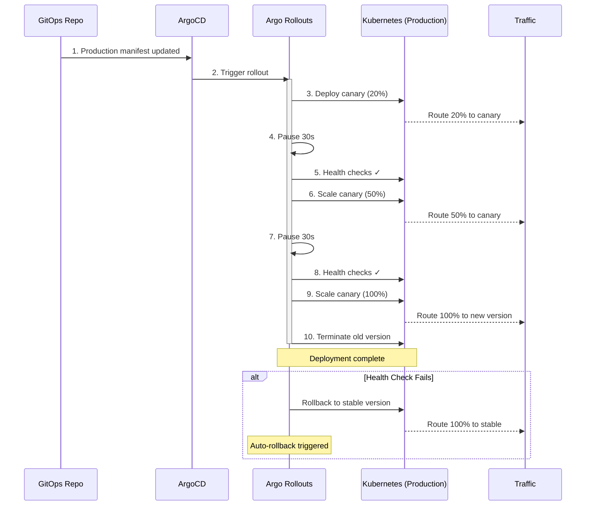
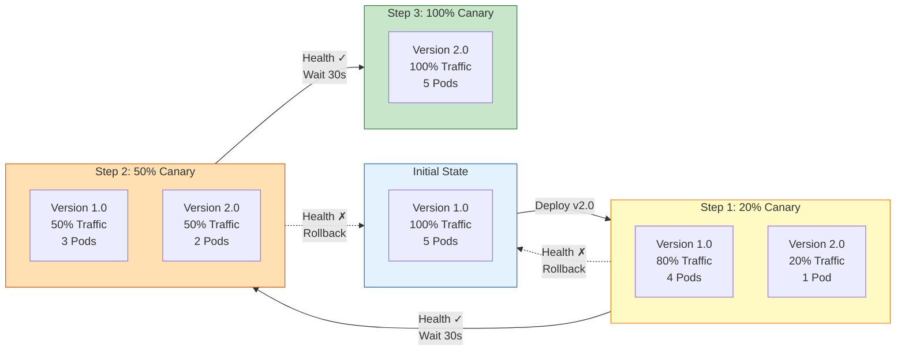

# Product Requirements Document: E2E SDLC Platform Engineering Demonstration

## Overview
- **Date**: October 25, 2025
- **Author**: Product Manager Agent
- **Status**: Draft
- **Repository**: https://github.com/DramisInfo/e2e-platform-engineering
- **Priority**: P2 (Demonstration/Reference Architecture)

## Problem Statement

Development and platform engineering teams need a concrete, hands-on demonstration of a modern end-to-end Software Development Lifecycle (SDLC) process. While many tools exist individually (CI/CD, GitOps, progressive delivery), teams struggle to understand how these components integrate cohesively in a real-world scenario.

There is a need for a reference implementation that:
- Showcases best practices in platform engineering
- Demonstrates the value of GitOps methodology
- Provides a quick-start environment for experimentation
- Serves as a training tool for both development and platform engineering teams

## Goals & Objectives

### Primary Goals
1. **Demonstrate E2E SDLC**: Create a fully functional demonstration of modern SDLC practices from code commit to production deployment
2. **Enable Self-Service Learning**: Provide automation scripts that allow developers to quickly set up and experiment with the entire stack
3. **Showcase GitOps Best Practices**: Illustrate proper separation of concerns between CI (GitHub Actions) and CD (ArgoCD)
4. **Prove Progressive Delivery**: Demonstrate canary deployments with automated rollback capabilities

### Success Metrics
- Setup time < 15 minutes for a developer with prerequisites installed
- Complete PR-to-Production cycle demonstrates in < 10 minutes
- Zero manual intervention required for standard deployment flow
- 100% automation of infrastructure setup and teardown
- Documentation sufficient for team members to run demo independently

## Target Users

### Primary Personas

**1. Platform Engineers**
- Need to understand and implement modern deployment strategies
- Want to evaluate tools before adopting them
- Require reference architectures for team guidance

**2. Software Developers**
- Need to understand how their code flows through the pipeline
- Want to see the impact of GitOps on their workflow
- Require visibility into deployment processes

### Secondary Personas

**3. Technical Leadership**
- Need to understand ROI of modern platform engineering practices
- Want to see feasibility demonstrations before investment decisions
- Require clear documentation for team enablement

## User Stories

### Platform Engineer Stories
```
As a platform engineer,
I want to quickly spin up a local Kubernetes environment with ArgoCD and Argo tools,
So that I can experiment with GitOps patterns without cloud costs.

As a platform engineer,
I want to see how Argo Events triggers integration tests automatically,
So that I can implement similar patterns in our production systems.

As a platform engineer,
I want to understand canary deployment configuration,
So that I can reduce risk in production rollouts.
```

### Developer Stories
```
As a developer,
I want to create a PR and see it automatically flow through CI/CD to production,
So that I can understand the full deployment lifecycle.

As a developer,
I want to see how my code changes trigger automated tests,
So that I can have confidence in the deployment process.

As a developer,
I want clear documentation and scripts,
So that I can quickly reproduce the demo environment for learning.
```

## Requirements

### Functional Requirements

#### FR1: Application Components
- **FR1.1**: Frontend application (static web interface)
- **FR1.2**: Backend REST API with multiple endpoints
- **FR1.3**: Frontend communicates with backend API
- **FR1.4**: Health check endpoints for both components
- **FR1.5**: Version/build information exposed via API

#### FR2: CI Pipeline (GitHub Actions)
- **FR2.1**: Automated build triggered on pull request
- **FR2.2**: Unit tests execution for frontend and backend
- **FR2.3**: Linting and code quality checks
- **FR2.4**: Container image building with proper tagging (commit SHA, semantic versioning)
- **FR2.5**: Push images to GitHub Packages
- **FR2.6**: Update GitOps manifests with new image tags (automated PR or direct commit)
- **FR2.7**: PR status checks that block merge if CI fails

#### FR3: GitOps Repository Structure
- **FR3.1**: Separate folders: `/app` for application code, `/gitops` for Kubernetes manifests
- **FR3.2**: Environment-specific configurations: `/gitops/staging` and `/gitops/production`
- **FR3.3**: Kustomize or Helm-based configuration management
- **FR3.4**: ArgoCD Application manifests for both environments
- **FR3.5**: Argo Rollouts configuration for canary deployment strategy

#### FR4: Local Kubernetes Environment
- **FR4.1**: k3d cluster creation with appropriate configuration
- **FR4.2**: Multiple clusters or namespaces for staging and production simulation
- **FR4.3**: Automated installation of ArgoCD
- **FR4.4**: Automated installation of Argo Rollouts controller
- **FR4.5**: Automated installation of Argo Events
- **FR4.6**: Ingress controller configuration for local access

#### FR5: Continuous Deployment (ArgoCD)
- **FR5.1**: ArgoCD watches GitOps repository for configuration changes
- **FR5.2**: Automatic sync to staging environment
- **FR5.3**: Application health monitoring
- **FR5.4**: Sync status visibility via ArgoCD UI
- **FR5.5**: Rollback capabilities

#### FR6: Integration Testing (Argo Events)
- **FR6.1**: Event sensor detects successful staging deployment
- **FR6.2**: Trigger REST API integration tests automatically
- **FR6.3**: Trigger Playwright E2E tests automatically
- **FR6.4**: Test results published/visible
- **FR6.5**: Automated promotion to production if tests pass

#### FR7: Progressive Delivery (Argo Rollouts)
- **FR7.1**: Canary deployment strategy configuration
- **FR7.2**: Gradual traffic shifting (e.g., 20% → 50% → 100%)
- **FR7.3**: Automated rollback on failure detection
- **FR7.4**: Manual approval gate option (configurable)
- **FR7.5**: Deployment status and metrics visibility

#### FR8: Testing
- **FR8.1**: REST API tests that validate backend endpoints
- **FR8.2**: Playwright E2E tests that validate frontend functionality
- **FR8.3**: Tests can be run locally and in CI/CD
- **FR8.4**: Test reports and artifacts stored/accessible

#### FR9: Automation Scripts
- **FR9.1**: One-command cluster setup script
- **FR9.2**: Prerequisites check script
- **FR9.3**: Demo reset/cleanup script
- **FR9.4**: Helper scripts for common operations
- **FR9.5**: Validation script to verify setup

#### FR10: Documentation
- **FR10.1**: Comprehensive README with quick start
- **FR10.2**: Architecture diagram showing all components
- **FR10.3**: Step-by-step walkthrough guide
- **FR10.4**: Troubleshooting guide
- **FR10.5**: Component-specific documentation

### Non-Functional Requirements

#### NFR1: Performance
- Complete setup time < 15 minutes (excluding downloads)
- PR-to-staging deployment < 5 minutes
- Staging-to-production promotion < 5 minutes
- Application response time < 500ms

#### NFR2: Usability
- Single command to set up entire environment
- Clear error messages with remediation steps
- Colored terminal output for better visibility
- Progress indicators for long-running operations

#### NFR3: Reliability
- Idempotent setup scripts (can be run multiple times)
- Graceful handling of partial failures
- Automatic retry for network-related operations
- Clean teardown without leftover resources

#### NFR4: Maintainability
- Well-structured, modular code
- Comprehensive inline comments
- Configuration externalized (avoid hardcoded values)
- Version pinning for all tools and dependencies

#### NFR5: Portability
- Works on Linux and macOS
- Minimal dependencies (Docker, kubectl, basic CLI tools)
- No cloud provider dependencies
- Network configuration that works in various environments

## Technical Specifications

### System Components Overview



### Technology Stack

#### Application Layer
- **Frontend**: React, Vue.js, or vanilla JavaScript (TBD based on simplicity)
- **Backend**: Node.js with Express, Python with FastAPI, or Go (TBD)
- **Container Runtime**: Docker
- **Base Images**: Official slim/alpine variants for minimal size

#### Infrastructure Layer
- **Local Kubernetes**: k3d (lightweight k3s in Docker)
- **Cluster Configuration**: 
  - Option A: 2 separate k3d clusters (staging, production)
  - Option B: 1 cluster with 2 namespaces
- **Ingress**: Traefik (bundled with k3d) or NGINX

#### CI/CD Layer
- **Version Control**: GitHub
- **CI**: GitHub Actions
- **Artifact Registry**: GitHub Packages (ghcr.io)
- **CD Engine**: ArgoCD
- **Event Automation**: Argo Events
- **Progressive Delivery**: Argo Rollouts

#### Configuration Management
- **Option A**: Kustomize (simpler, built into kubectl)
- **Option B**: Helm (more powerful, industry standard)
- **Recommendation**: Start with Kustomize for simplicity

#### Testing Framework
- **API Testing**: 
  - REST Client: curl, Newman (Postman CLI), or k6
  - Framework: Jest, Pytest, or native Go testing
- **E2E Testing**: Playwright
- **Test Execution**: Docker containers for consistency

### Architecture Overview



#### Flow Description

1. **Developer Push**: Code changes trigger GitHub Actions CI pipeline
2. **Build & Publish**: CI builds container images and pushes to GitHub Packages
3. **Update GitOps**: CI updates image tags in GitOps manifests
4. **ArgoCD Sync**: ArgoCD detects manifest changes and syncs to staging
5. **Deploy to Staging**: Applications deployed to staging namespace
6. **Trigger Tests**: Argo Events detects deployment and triggers integration tests
7. **Run Tests**: REST API and E2E tests execute automatically
8. **Promote to Production**: On test success, Argo Rollouts performs canary deployment

### Repository Structure

```
e2e-platform-engineering/
├── README.md
├── docs/
│   ├── architecture.md
│   ├── setup-guide.md
│   ├── walkthrough.md
│   └── troubleshooting.md
├── scripts/
│   ├── setup-cluster.sh          # Main setup script
│   ├── install-argocd.sh
│   ├── install-argo-rollouts.sh
│   ├── install-argo-events.sh
│   ├── cleanup.sh
│   ├── validate.sh
│   └── helpers/
│       ├── check-prerequisites.sh
│       └── port-forward.sh
├── app/
│   ├── frontend/
│   │   ├── Dockerfile
│   │   ├── package.json
│   │   ├── src/
│   │   └── tests/
│   └── backend/
│       ├── Dockerfile
│       ├── package.json (or requirements.txt, go.mod)
│       ├── src/
│       └── tests/
├── gitops/
│   ├── argocd/
│   │   ├── staging-app.yaml
│   │   └── production-app.yaml
│   ├── staging/
│   │   ├── kustomization.yaml
│   │   ├── frontend-deployment.yaml
│   │   ├── frontend-service.yaml
│   │   ├── backend-deployment.yaml
│   │   ├── backend-service.yaml
│   │   └── ingress.yaml
│   ├── production/
│   │   ├── kustomization.yaml
│   │   ├── frontend-rollout.yaml      # Argo Rollout instead of Deployment
│   │   ├── frontend-service.yaml
│   │   ├── backend-rollout.yaml
│   │   ├── backend-service.yaml
│   │   └── ingress.yaml
│   └── argo-events/
│       ├── event-source.yaml
│       ├── sensor.yaml
│       └── trigger-template.yaml
├── tests/
│   ├── integration/
│   │   ├── Dockerfile
│   │   └── api-tests.js (or .py, .go)
│   └── e2e/
│       ├── Dockerfile
│       └── playwright-tests.js
└── .github/
    └── workflows/
        ├── ci-frontend.yaml
        ├── ci-backend.yaml
        └── update-gitops.yaml
```

### Workflow Details

#### 1. Developer Workflow



#### 2. Staging Deployment Workflow



#### 3. Production Deployment Workflow



### Configuration Examples

#### Canary Deployment Strategy Visualization



#### Argo Rollout Canary Strategy
```yaml
apiVersion: argoproj.io/v1alpha1
kind: Rollout
metadata:
  name: backend
spec:
  replicas: 5
  strategy:
    canary:
      steps:
      - setWeight: 20
      - pause: {duration: 30s}
      - setWeight: 50
      - pause: {duration: 30s}
      - setWeight: 100
      maxSurge: "25%"
      maxUnavailable: 0
  revisionHistoryLimit: 3
  selector:
    matchLabels:
      app: backend
  template:
    metadata:
      labels:
        app: backend
    spec:
      containers:
      - name: backend
        image: ghcr.io/dramisinfo/e2e-platform-engineering/backend:latest
        ports:
        - containerPort: 8080
```

#### Argo Events Sensor
```yaml
apiVersion: argoproj.io/v1alpha1
kind: Sensor
metadata:
  name: test-trigger
spec:
  dependencies:
  - name: staging-deployed
    eventSourceName: argocd-events
    eventName: app-synced
    filters:
      data:
      - path: body.app
        type: string
        value:
        - "staging"
  triggers:
  - template:
      name: run-integration-tests
      k8s:
        operation: create
        source:
          resource:
            apiVersion: batch/v1
            kind: Job
            metadata:
              generateName: integration-tests-
            spec:
              template:
                spec:
                  containers:
                  - name: tests
                    image: ghcr.io/dramisinfo/e2e-platform-engineering/tests:latest
                    command: ["npm", "run", "test:integration"]
                  restartPolicy: Never
```

## User Experience

### Setup Experience

**Target: < 15 minutes from clone to running demo**

```bash
# 1. Clone repository
git clone https://github.com/DramisInfo/e2e-platform-engineering.git
cd e2e-platform-engineering

# 2. Check prerequisites
./scripts/check-prerequisites.sh

# 3. One-command setup
./scripts/setup-cluster.sh

# Setup script will:
# - Create k3d cluster(s)
# - Install ArgoCD
# - Install Argo Rollouts
# - Install Argo Events
# - Bootstrap ArgoCD applications
# - Print access URLs and credentials

# 4. Validate setup
./scripts/validate.sh
```

### Developer Experience

#### Making Changes
```bash
# 1. Create feature branch
git checkout -b feature/new-endpoint

# 2. Make changes to app/backend/src/

# 3. Test locally
cd app/backend
npm test
npm start

# 4. Create PR - CI runs automatically

# 5. Merge PR - automatic deployment to staging

# 6. Watch deployment
kubectl get rollouts -n production --watch
# or access ArgoCD UI
```

#### Viewing Results
```bash
# Access applications
open http://staging.local:8080    # Staging frontend
open http://production.local:8080 # Production frontend

# Access ArgoCD UI
./scripts/helpers/port-forward.sh argocd
open http://localhost:8080

# View logs
kubectl logs -n staging -l app=backend -f
```

### UI/Dashboard Access

1. **ArgoCD UI**: Visual representation of GitOps sync status
2. **Argo Rollouts Dashboard**: Canary deployment visualization
3. **Application UI**: Simple web interface showing version info
4. **kubectl/k9s**: Terminal-based cluster exploration

## Scope

### In Scope - MVP

#### Core Functionality
- ✅ Simple frontend + backend application
- ✅ GitHub Actions CI pipeline
- ✅ Image publishing to GitHub Packages
- ✅ Local k3d Kubernetes cluster
- ✅ ArgoCD GitOps deployment
- ✅ Argo Events integration test triggering
- ✅ Argo Rollouts canary deployment
- ✅ REST API integration tests
- ✅ Playwright E2E tests
- ✅ Staging and production environments
- ✅ Automated setup scripts
- ✅ Comprehensive documentation
- ✅ Architecture diagrams

#### Documentation
- ✅ README with quick start
- ✅ Setup guide
- ✅ Architecture documentation
- ✅ Demo walkthrough
- ✅ Troubleshooting guide

#### Automation
- ✅ One-command cluster setup
- ✅ Prerequisites checker
- ✅ Validation script
- ✅ Cleanup script
- ✅ Helper utilities

### Out of Scope - Future Enhancements

#### Not in MVP
- ❌ Database integration
- ❌ Observability stack (Prometheus, Grafana, Loki)
- ❌ Service mesh (Istio, Linkerd)
- ❌ Security scanning in pipeline
- ❌ Secret management (Vault, Sealed Secrets)
- ❌ Cost analysis
- ❌ Multi-cluster setup
- ❌ Cloud provider deployment
- ❌ Disaster recovery procedures
- ❌ Performance testing/load testing
- ❌ A/B testing capabilities
- ❌ Feature flags
- ❌ Blue-green deployment strategy
- ❌ Multi-region deployment

#### Potential Phase 2 Features
- Observability stack integration
- Security scanning (Trivy, Snyk)
- Database with migrations
- Service mesh demonstration
- Advanced Argo Rollouts strategies (A/B, blue-green)
- Multi-cluster GitOps
- Policy enforcement (OPA, Kyverno)

## Success Metrics

### Quantitative Metrics

1. **Setup Time**: < 15 minutes from clone to functional environment
2. **Build Time**: < 5 minutes for complete CI pipeline
3. **Deployment Time**: < 3 minutes from merge to staging deployment
4. **Test Execution Time**: < 2 minutes for integration tests
5. **Promotion Time**: < 5 minutes from test pass to production deployment
6. **Script Success Rate**: 100% idempotent execution
7. **Documentation Coverage**: All components documented

### Qualitative Metrics

1. **Ease of Use**: Team members can set up without assistance
2. **Learning Value**: Users understand GitOps concepts after walkthrough
3. **Reproducibility**: Demo can be run consistently across different machines
4. **Clarity**: Architecture and workflow are immediately understandable
5. **Extensibility**: Easy to add new features or modify existing ones

### Acceptance Criteria

#### Must Have (P0)
- [ ] Complete CI/CD pipeline from PR to production
- [ ] Automated GitOps deployment via ArgoCD
- [ ] Canary deployment with Argo Rollouts
- [ ] Integration tests triggered by Argo Events
- [ ] One-command setup script that works consistently
- [ ] README with quick start guide
- [ ] Architecture diagram

#### Should Have (P1)
- [ ] Playwright E2E tests
- [ ] Rollback demonstration
- [ ] Comprehensive troubleshooting guide
- [ ] Demo walkthrough documentation
- [ ] Validation script
- [ ] Helper utilities for common operations

#### Nice to Have (P2)
- [ ] Video walkthrough
- [ ] Automated demo mode (scripted changes)
- [ ] Performance benchmarks
- [ ] Comparison with other approaches

## Timeline & Milestones

**Priority**: P2 (No hard deadline, reference architecture)

### Suggested Phased Approach

#### Phase 1: Foundation (Week 1-2)
- Set up repository structure
- Create simple frontend and backend applications
- Implement GitHub Actions CI pipeline
- Set up GitHub Packages integration
- Basic documentation

#### Phase 2: Infrastructure (Week 2-3)
- Create k3d cluster setup scripts
- Install and configure ArgoCD
- Create GitOps repository structure
- Implement basic Kustomize/Helm configurations
- Deploy to staging manually

#### Phase 3: Automation (Week 3-4)
- Install and configure Argo Rollouts
- Implement canary deployment strategy
- Install and configure Argo Events
- Create integration test framework
- Wire up automated testing

#### Phase 4: Testing (Week 4-5)
- Implement REST API integration tests
- Implement Playwright E2E tests
- Configure Argo Events to trigger tests
- Implement automated promotion logic
- Test rollback scenarios

#### Phase 5: Polish (Week 5-6)
- Complete documentation
- Create architecture diagrams
- Refine automation scripts
- Add validation and cleanup scripts
- User acceptance testing

**Total Estimated Time**: 5-6 weeks (flexible, demonstration project)

## Dependencies

### External Dependencies

#### Prerequisites (User-Installed)
- **Docker**: Container runtime (required for k3d)
- **kubectl**: Kubernetes CLI (v1.24+)
- **k3d**: Lightweight Kubernetes (v5.0+)
- **git**: Version control
- **curl/wget**: Script downloads
- **jq**: JSON processing in scripts

#### Optional Tools
- **k9s**: Terminal-based Kubernetes UI
- **helm**: If using Helm instead of Kustomize
- **kustomize**: If not using kubectl built-in version

### Internal Dependencies

#### GitHub Configuration
- GitHub repository access
- GitHub Packages enabled
- GitHub Actions enabled
- Personal Access Token (for pushing images)

#### Repository Dependencies
- None initially (self-contained demo)
- Can be forked/cloned independently

### Tool Versions

```yaml
kubernetes: ">=1.24"
k3d: ">=5.0"
argocd: ">=2.8"
argo-rollouts: ">=1.6"
argo-events: ">=1.9"
docker: ">=20.10"
kubectl: ">=1.24"
```

## Risks & Mitigations

### Technical Risks

#### Risk 1: Local Network Complexity
**Impact**: High  
**Probability**: Medium  
**Description**: k3d networking and ingress configuration can be tricky across different environments

**Mitigation**:
- Provide multiple networking configuration options
- Use LoadBalancer + port mapping as fallback
- Clear documentation for common network issues
- Test on multiple operating systems

#### Risk 2: Resource Constraints
**Impact**: Medium  
**Probability**: Medium  
**Description**: Running full stack locally may require significant resources (CPU, memory)

**Mitigation**:
- Optimize container images (use slim/alpine variants)
- Set appropriate resource limits
- Provide resource requirements in documentation
- Create "lightweight" mode with reduced replicas

#### Risk 3: Version Compatibility
**Impact**: Medium  
**Probability**: Low  
**Description**: Tool version mismatches could break setup

**Mitigation**:
- Pin all tool versions in scripts
- Test with multiple version combinations
- Provide version compatibility matrix
- Regular maintenance and updates

#### Risk 4: GitHub Actions Complexity
**Impact**: Medium  
**Probability**: Low  
**Description**: CI pipeline might become complex with multiple services

**Mitigation**:
- Keep workflows modular and well-commented
- Use reusable workflows where possible
- Provide workflow visualization
- Document troubleshooting steps

### Operational Risks

#### Risk 5: Learning Curve
**Impact**: Medium  
**Probability**: Medium  
**Description**: Users may struggle with multiple new tools simultaneously

**Mitigation**:
- Progressive documentation (basic → advanced)
- Step-by-step walkthrough guide
- Troubleshooting guide with common issues
- Glossary of terms and concepts

#### Risk 6: Maintenance Burden
**Impact**: Low  
**Probability**: Medium  
**Description**: Demo may become outdated as tools evolve

**Mitigation**:
- Document maintenance procedures
- Use automated dependency updates (Dependabot)
- Regular testing cadence
- Clear ownership and maintenance plan

## Acceptance Criteria

### Functional Acceptance Criteria

#### AC1: Complete CI/CD Flow
```gherkin
Given a developer creates a pull request with code changes
When the PR is merged to main branch
Then the CI pipeline builds and publishes container images
And the GitOps manifests are updated automatically
And ArgoCD deploys to staging environment
And integration tests are triggered automatically
And upon test success, production deployment begins
And canary rollout completes successfully
```

#### AC2: Setup Automation
```gherkin
Given a user with prerequisites installed
When they run ./scripts/setup-cluster.sh
Then a k3d cluster is created successfully
And ArgoCD is installed and accessible
And Argo Rollouts is installed
And Argo Events is installed
And initial applications are deployed
And all components are healthy
And the setup completes in under 15 minutes
```

#### AC3: Testing Automation
```gherkin
Given the application is deployed to staging
When Argo Events detects the deployment
Then integration tests are triggered
And REST API tests execute successfully
And E2E tests execute successfully
And test results are visible
And production promotion occurs on success
```

#### AC4: Canary Deployment
```gherkin
Given production GitOps manifests are updated
When ArgoCD syncs the changes
Then Argo Rollouts begins canary deployment
And traffic shifts progressively (20% → 50% → 100%)
And health checks occur at each stage
And rollout completes without manual intervention
```

#### AC5: Documentation Quality
```gherkin
Given a new user accesses the repository
When they read the README
Then they understand the project purpose
And they can identify prerequisites
And they can follow setup instructions
And they can access detailed documentation
And they can find troubleshooting help
```

### Non-Functional Acceptance Criteria

#### Performance
- [ ] Setup completes in < 15 minutes
- [ ] CI pipeline completes in < 5 minutes
- [ ] Staging deployment completes in < 3 minutes
- [ ] Integration tests complete in < 2 minutes
- [ ] Canary rollout completes in < 5 minutes

#### Reliability
- [ ] Setup script is idempotent
- [ ] Cleanup script removes all resources
- [ ] Rollback functions correctly
- [ ] Tests are deterministic (no flaky tests)

#### Usability
- [ ] Single command setup
- [ ] Clear error messages
- [ ] Progress indicators for long operations
- [ ] Accessible UI dashboards

#### Maintainability
- [ ] Code is well-commented
- [ ] Configuration is externalized
- [ ] Scripts are modular
- [ ] Documentation is comprehensive

## Open Questions

### Technical Decisions

1. **Application Language**: 
   - Node.js (most accessible), Python (popular), or Go (performance)?
   - **Recommendation**: Node.js for both frontend and backend for consistency

2. **Configuration Management**:
   - Kustomize (simpler) or Helm (more powerful)?
   - **Recommendation**: Kustomize for MVP, Helm example as future enhancement

3. **Cluster Strategy**:
   - 2 separate k3d clusters or 1 cluster with 2 namespaces?
   - **Recommendation**: 1 cluster, 2 namespaces (simpler, fewer resources)

4. **GitOps Updates**:
   - CI directly commits to main, or creates PR?
   - **Recommendation**: Direct commit for demo simplicity, document PR option

5. **Test Container Location**:
   - Separate test images or bundled with app?
   - **Recommendation**: Separate test images (cleaner separation)

### Process Questions

6. **Manual Approval Gates**:
   - Should production promotion be fully automated or have manual gates?
   - **Recommendation**: Fully automated by default, document manual gate option

7. **Failure Handling**:
   - How should failed deployments be communicated?
   - **Recommendation**: ArgoCD notifications, document Slack webhook option

8. **Demo Data**:
   - Should we include sample data or API responses?
   - **Recommendation**: Yes, simple mock data for realistic demo

## Appendix

### Glossary

- **GitOps**: Operational framework using Git as single source of truth for infrastructure and application definitions
- **Canary Deployment**: Progressive rollout strategy that gradually shifts traffic to new version
- **k3d**: Lightweight wrapper to run k3s (Rancher's minimal Kubernetes distribution) in Docker
- **ArgoCD**: Declarative GitOps continuous delivery tool for Kubernetes
- **Argo Rollouts**: Kubernetes controller providing advanced deployment strategies
- **Argo Events**: Event-driven workflow automation framework for Kubernetes
- **Kustomize**: Kubernetes native configuration management tool
- **Playwright**: End-to-end testing framework for web applications

### References

- [ArgoCD Documentation](https://argo-cd.readthedocs.io/)
- [Argo Rollouts Documentation](https://argoproj.github.io/argo-rollouts/)
- [Argo Events Documentation](https://argoproj.github.io/argo-events/)
- [k3d Documentation](https://k3d.io/)
- [GitOps Principles](https://opengitops.dev/)
- [Kubernetes Documentation](https://kubernetes.io/docs/)
- [GitHub Actions Documentation](https://docs.github.com/en/actions)
- [GitHub Packages Documentation](https://docs.github.com/en/packages)

### Version History

| Version | Date | Author | Changes |
|---------|------|--------|---------|
| 0.1 | 2025-10-25 | Product Manager Agent | Initial draft |

---

**Next Steps**:
1. Review and approve PRD
2. Refine technical decisions (language, tooling)
3. Create GitHub project/issues for tracking
4. Begin Phase 1 implementation
5. Schedule regular demo checkpoints
